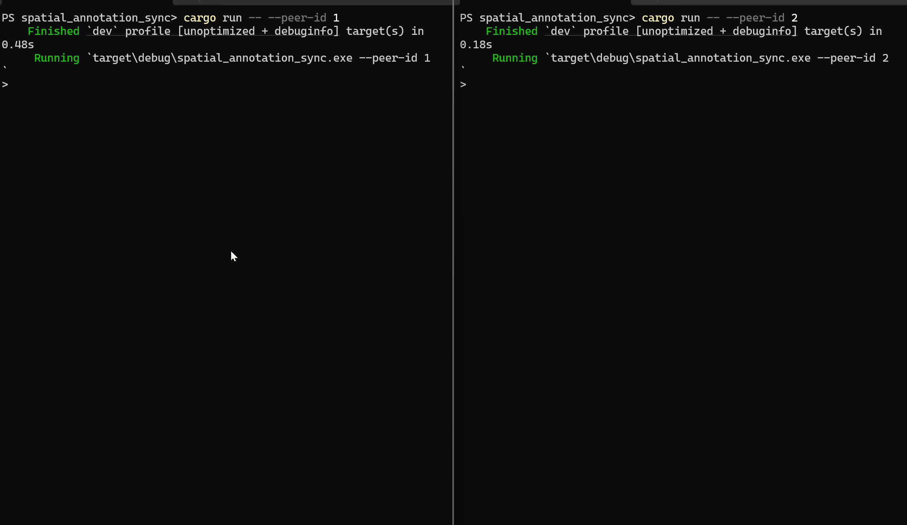

# Spatial Annotation Sync

[](https://github.com/litaoz/spatial_annotation_sync/actions/workflows/rust.yml)

A CRDT-based sync library — with a CLI demo — for collaborative AR annotations. Two peers can edit the same spatial annotations while offline, reconnect over localhost, and deterministically converge to the same state with no server arbitrating conflicts.

## Why

Collaborative AR apps need a data layer that keeps working when a client is offline and can't wait for a server round-trip. This project is a minimal proof of concept for that problem: a `SpatialAnnotation` (id, coordinate, text) modeled as an LWW-register-based CRDT map, synced peer-to-peer over TCP, with a CLI you can drive by hand to watch two independent clients converge.

## Demo




## Features

- Create, edit, move, and delete spatial annotations independently on two peers, fully offline
- Peer-to-peer sync over plain TCP — no server, just reconnect and both sides converge automatically
- Last-Write-Wins conflict resolution applied per field (coordinate and text resolve independently), including deletes
- Property-based tests (via `proptest`) that prove convergence holds under arbitrary operation orderings — commutativity, associativity, and idempotence of merge

## Getting Started

### Prerequisites
- Rust (2024 edition toolchain — install via [rustup](https://rustup.rs))

### Build
```sh
cargo build
```

### Run two peers
Open two terminals:
```sh
# terminal 1
cargo run -- --peer-id 1

# terminal 2
cargo run -- --peer-id 2
```
Peer 1 listens on `127.0.0.1:3000`, peer 2 on `127.0.0.1:3001`. Both start seeded with the same three annotations so you can see them diverge and reconverge.

## CLI Commands

| Command | Syntax | Notes |
|---|---|---|
| `list` | `list` | Show all annotations, including tombstoned (deleted) ones |
| `add` | `add <id> <coord> <text>` | e.g. `add 4 (1,2) "New annotation"` |
| `edit` | `edit <id> <text>` | Full-replace of the text field |
| `move` | `move <id> <coord>` | Full-replace of the coordinate |
| `delete` | `delete <id>` | Tombstones the annotation — fields are cleared, not removed from history |
| `sync` | `sync <host:port>` | Connects to a peer, exchanges state, and merges — e.g. `sync 127.0.0.1:3001` |
| `exit` | `exit` | Quit |

Coordinates are `(x,y)` — write them with **no space** after the comma, or quote the whole thing (`"(1, 2)"`), since a bare space breaks tokenization. Multi-word text needs quotes too: `add 4 (1,2) "hello world"`.

## How It Works

Each annotation's coordinate and text are independent [LWW registers](https://en.wikipedia.org/wiki/Conflict-free_replicated_data_type#LWW-Element-Set_(Last-Write-Wins-Element-Set)): every write carries a timestamp, and on merge, the register with the later timestamp wins. A delete isn't a special operation — it's a write that clears both fields — so it's resolved by the same timestamp comparison as any edit, with no extra logic needed.

**Concurrent edits:** Alice moves an annotation to `(1,2)` while Bob moves it to `(4,5)`, both offline. Whoever's write has the later timestamp wins after sync, and both peers converge to that coordinate.

**Delete vs. edit:** Alice deletes an annotation while Bob edits it, both offline and unaware of each other's change. After sync, whichever operation is chronologically later wins, deterministically, with no manual conflict resolution required.

Sync itself is a full-state exchange: each peer serializes its whole environment as JSON over a length-prefixed TCP frame and merges whatever it receives.

## Known Limitations

Deliberate scope cuts for a demo project, not oversights:

- **No partial field updates** — `edit`/`move` always full-replace the field; there's no "update just one nested property" support
- **No tombstone garbage collection** — deleted annotations stay in memory forever as tombstones
- **JSON wire format** — `serde_json` was chosen for readability over a compact binary format like `postcard`/`bincode`, which would be the production choice
- **Two peers only, localhost only** — no discovery, no auth, no real network deployment
- **No persistence** — state is in-memory only; restarting a peer resets it to the seed data

## Testing

```sh
cargo test
```

Includes unit tests for the CRDT merge logic, plus `proptest`-based property tests (`tests/convergence.rs`) that generate arbitrary sequences of create/update/delete operations across two or three peers and assert merge is commutative, associative, and idempotent regardless of operation order.

## License

[MIT](LICENSE)
